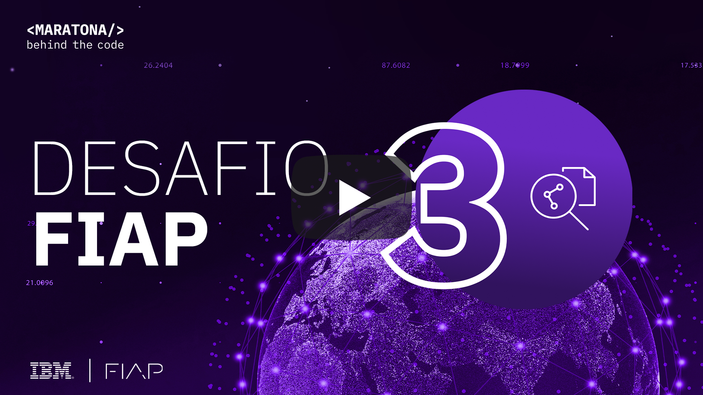
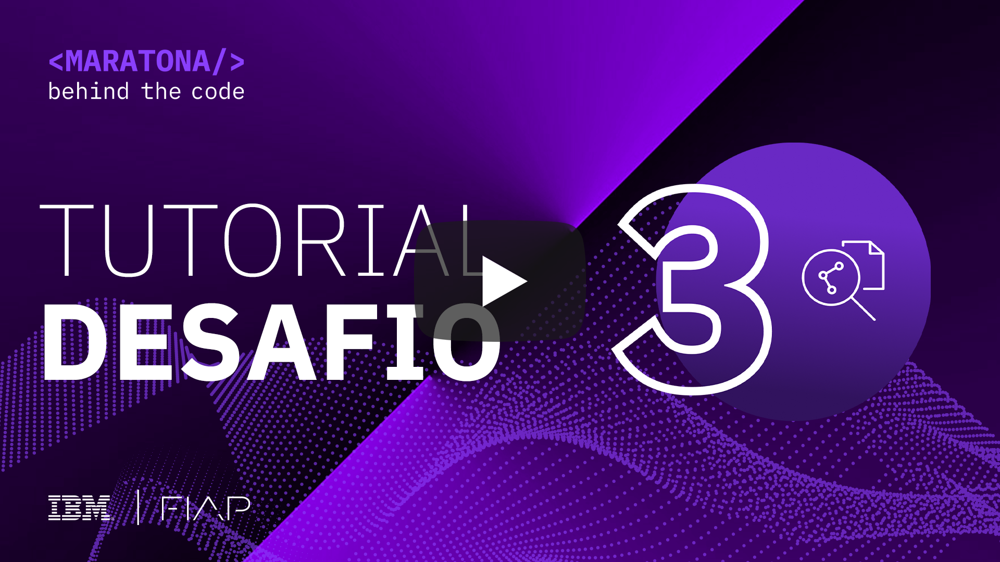
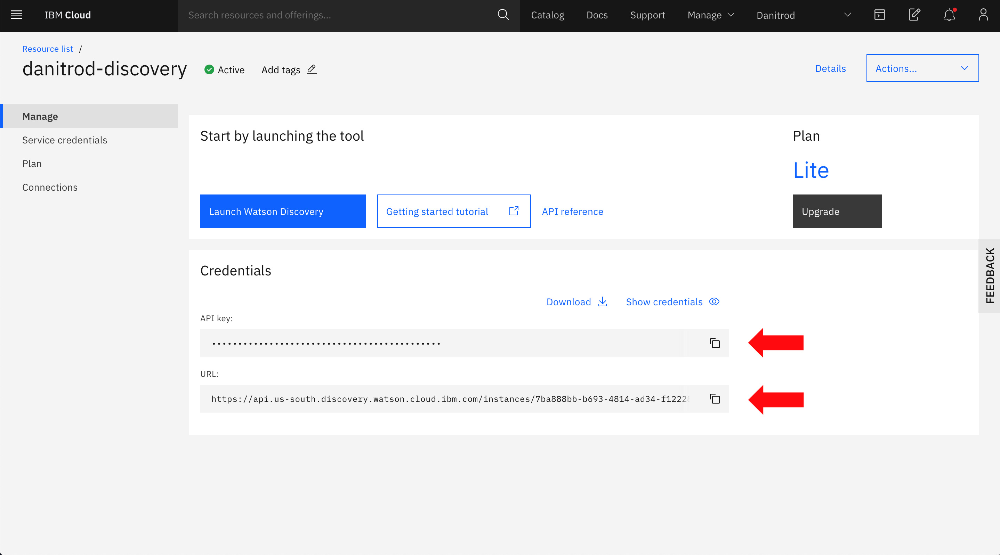
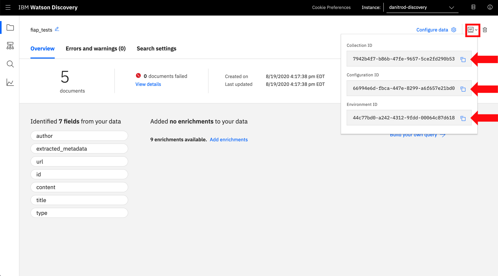

[](https://cloud.ibm.com)
<a href="https://discord.gg/2NRPpcU">
</a>

# Desafio 03 | FIAP

- [1. Sobre a FIAP](#1-sobre-a-fiap)
  - [1.1. Introdução](#11-introdução)
  - [1.2. Premiação](#12-premiação)
- [2. Desafio de negócio](#2-desafio-de-negocio)
- [3. Objetivo](#3-objetivo)
- [4. Desenvolvendo a Solução](#4-desenvolvendo-a-solucao)
  - [4.1. Pré-requisitos](#41-pré-requisitos)
  - [4.2. Resumo das tarefas](#42-resumo-das-tarefas)
  - [4.3. Desenvolvimento](#43-desenvolvimento)
- [5. Submissão](#5-submissão)
- [6. Sobre a avaliação](#6-sobre-a-avaliação)

## Para te ajudar

- [Material de Apoio](#material-de-apoio)
- [Em caso de dúvidas](#em-caso-de-duvidas)
- [License](#license)

## 1. Sobre a FIAP

### 1.1. Introdução

A FIAP é um Centro Universitário com conceito máximo pelo MEC, referência em tecnologia, inovação e negócios.
Acreditamos que educação contínua, ciência, humanidade e tecnologia serão os grandes vetores de transformação para criarmos um novo presente e um melhor amanhã.
Cursos presenciais e digitais: 15 graduações, 25 MBAs e diversos cursos remotos curta duração.

<div align="center">
    <a href="https://www.youtube.com/watch?v=iaX8y5WhWE0">
       </img>
    </a>
</div>

### 1.2. Premiação

5 bolsas de graduação ou MBA em qualquer curso da universidade, à escolha do beneficiado, para os 5 melhores colocados nesse desafio.

## 2. Desafio de negócio

O desafio consiste em criar uma ferramenta capaz de acelerar e dinamizar os processos de aprendizagem, ajudando estudantes a encontrar outras fontes de pesquisa, novos conteúdos, exemplos e modelos para seus estudos. Utilizando linguagem natural a ferramenta será capaz de buscar e sugerir conteúdos alternativos, como vídeos, podcasts, e-books e demais fontes de informações, para que estudantes possam aprofundar seus estudos a partir de indicações de texto do próprio estudante.

## 3. Objetivo

Neste desafio, você deverá utilizar a ferramenta da IBM de inteligência artificial aplicada à busca cognitiva em bases de dados, [Watson Discovery](https://cloud.ibm.com/catalog/services/discovery), para criar um modelo capaz de recomendar artigos ou vídeos baseados no interesse do usuário. Sua tarefa será estruturar documentos e treinar diversas buscas para esses documentos no serviço.

Veja no vídeo abaixo uma explicação completa dos passos necessários para resolução desse desafio.

<div align="center">
    <a href="https://www.youtube.com/watch?v=dlhcp_7GHa4">
       </img>
    </a>
</div>

## 4. Desenvolvendo a solução

### 4.1. Pré-requisitos

Para realizar esse desafio você deverá cumprir os seguintes pré-requisitos:

- Registrar-se na [Maratona Behind the Code](https://ibm.biz/maratona) e confirmar seu e-mail de cadastro.
- Possuir uma conta na [IBM Cloud](https://ibm.biz/registro-maratona), podendo ser a conta FREE ou pay-as-you-go (não é necessário registrar-se no evento com o mesmo e-mail utilizado para criar sua conta na IBM Cloud).

### 4.2. Resumo das tarefas

1. Instanciar o [Watson Discovery](https://cloud.ibm.com/catalog/services/discovery) na IBM Cloud;
2. Acessar as páginas cujas URLs estão listadas no item [4.3](#43-desenvolvimento);
3. Criar documentos no formato JSON da forma especificada no item [4.3](#43-desenvolvimento);
4. Criar uma coleção nova no Watson Discovery e fazer o upload de seus documentos;
5. Treinar respostas a _queries_ no Watson Discovery baseando-se nos documentos fornecidos;
6. Acessar a página https://fiap.maratona.dev, testar e submeter sua solução.

### 4.3. Desenvolvimento

Durante o desafio, você irá enfrentar dois problemas comuns de um cientista de dados, que são o da estruturação de dados e o da curadoria de modelos de aprendizado de máquina. O primeiro será encontrado ao extrair informações das páginas web listadas abaixo, e o segundo será encontrado ao testar o modelo de Watson Discovery com perguntas customizadas. Oferecemos algumas perguntas de exemplo, mas você terá que pensar em mais perguntas relacionadas aos documentos para treiná-lo, de modo que o número de perguntas totalize em no mínimo 49.

As páginas para as quais pedimos a extração de documentos são de dois tipos diferentes de conteúdo: `article` (artigo) e `video` (vídeo). As de conteúdos em vídeo são de palestras Ted Talks, em que as transcrições em português das falas já estão disponíveis, enquanto as de artigo são de alguns artigos relacionados a tecnologia e inteligência artificial disponíveis em diversos _websites_. Abaixo está a lista de URLs para as quais pedimos a extração:

- https://www.ted.com/talks/helen_czerski_the_fascinating_physics_of_everyday_life/transcript?language=pt-br#t-81674
- https://www.ted.com/talks/kevin_kelly_how_ai_can_bring_on_a_second_industrial_revolution/transcript?language=pt-br
- https://www.ted.com/talks/sarah_parcak_help_discover_ancient_ruins_before_it_s_too_late/transcript?language=pt-br
- https://www.ted.com/talks/sylvain_duranton_how_humans_and_ai_can_work_together_to_create_better_businesses/transcript?language=pt-br
- https://www.ted.com/talks/chieko_asakawa_how_new_technology_helps_blind_people_explore_the_world/transcript?language=pt-br
- https://www.ted.com/talks/pierre_barreau_how_ai_could_compose_a_personalized_soundtrack_to_your_life/transcript?language=pt-br
- https://www.ted.com/talks/tom_gruber_how_ai_can_enhance_our_memory_work_and_social_lives/transcript?language=pt-br
- https://olhardigital.com.br/colunistas/wagner_sanchez/post/o_futuro_cada_vez_mais_perto/78972
- https://olhardigital.com.br/colunistas/wagner_sanchez/post/os_riscos_do_machine_learning/80584
- https://olhardigital.com.br/ciencia-e-espaco/noticia/nova-teoria-diz-que-passado-presente-e-futuro-coexistem/97786
- https://olhardigital.com.br/noticia/inteligencia-artificial-da-ibm-consegue-prever-cancer-de-mama/87030
- https://olhardigital.com.br/ciencia-e-espaco/noticia/inteligencia-artificial-ajuda-a-nasa-a-projetar-novos-trajes-espaciais/102772
- https://olhardigital.com.br/colunistas/jorge_vargas_neto/post/como_a_inteligencia_artificial_pode_mudar_o_cenario_de_oferta_de_credito/78999
- https://olhardigital.com.br/ciencia-e-espaco/noticia/cientistas-criam-programa-poderoso-que-aprimora-deteccao-de-galaxias/100683
- https://www.startse.com/noticia/startups/mobtech/deep-learning-o-cerebro-dos-carros-autonomos

A partir dessas URLs, pedimos que você monte documentos JSON contendo as seguintes chaves e valores:

```json
{
  "author": "Autor/Autora do conteúdo",
  "body": "Corpo do conteúdo (transcrição da palestra ou todo o corpo de um artigo)",
  "title": "Título da palestra ou artigo",
  "type": "Tipo do conteúdo (deve ser exatamente article ou video)",
  "url": "URL onde o conteúdo foi acessado"
}
```

**Os nomes das chaves devem ser exatamente esses para garantir que o seu modelo consiga ser bem avaliado. Na chave "type", o valor deverá ser sempre `article`, no caso de um artigo, ou `video`, no caso de um vídeo.** O nome do arquivo não é relevante para o treinamento.

[Encontre aqui um exemplo de documento JSON preenchido](./doc/source/assets/deep_learning_conheca_o_cerebro_dos_carros_autonomos.json).

Após a criação dos documentos, você deverá criar uma coleção no Watson Discovery e inseri-los na sua coleção. Após o carregamento dos documentos, você deverá treinar as respostas do modelo a algumas perguntas, identificando quais documentos são relevantes para tal resposta e quais não são. O seu modelo deve ter no mínimo **49 _queries_** treinadas, cada uma com pelo menos um documento marcado como relevante ou não relevante, para que possa ser treinado. Disponibilizamos alguns exemplos de _queries_ para iniciar o treinamento (note que algumas perguntas não têm relação com nenhum dos documentos, para essas, todas as sugestões devem ser marcadas como não relevantes):

- "Gostaria de um artigo que falasse sobre inteligência artificial e carros autônomos
- "Os riscos do Machine Learning"
- "Artigo sobre as teorias sobre o tempo"
- "Vídeo sobre estatística avançada"
- "História do Brasil"

_Dica: a etapa do carregamento dos documentos no Watson Discovery pode demorar alguns minutos e às vezes falhar. É recomendado que seja feito o upload de apenas um documento por vez para garantir que não haja nenhuma falha._

## 5. Submissão

Para realizar a submissão, primeiramente você deverá acessar a seguinte aplicação: https://fiap.maratona.dev/ e preencher o formulário com as credenciais de sua instância do **Watson Discovery** e os **ID**s da sua coleção. Nessa página você será capaz de testar o seu modelo antes de submeter.

Abaixo estão imagens de onde encontrar as credenciais do Watson Discovery:
</img>
</img>

🚨 **NÃO ESQUEÇA DE SUBMETER SUA SOLUÇÃO** 🚨

Após a realização dos testes, clique no botão no canto inferior direito para SUBMETER SUA SOLUÇÃO, conforme a imagem abaixo, e preencha o formulário com seu e-mail utilizado no registro na [MARATONA 2020](https://maratona.dev/pt).

</img>

## 6. Sobre a avaliação

Nosso sistema de avaliação automática irá fazer _queries_ para o seu modelo e analisar se as respostas obtidas são coerentes com os documentos esperados. Os documentos da sua solução devem **obrigatoriamente** conter as chaves com os nomes especificados aqui, `author`, `body`, `title`, `type`, `url`, com seus respectivos valores, para que a validação seja sucedida.

O tempo de entrega não entra no cálculo da pontuação do desafio. Entretanto, para todos os participantes que entregarem esse desafio na primeira semana após o lançamento receberão um bônus de 10% da pontuação final.

## Material de apoio

- [Documentação completa do Watson Discovery, com boas práticas e mais](https://cloud.ibm.com/docs/discovery?topic=discovery-improving-result-relevance-with-the-tooling&locale=pt-BR)

Você também pode acessar o discord oficial da Maratona 2020 para realizar perguntas e/ou interagir com outros participantes: [Discord](https://discord.gg/2NRPpcU).

## License

Copyright 2020 Maratona Behind the Code

Licensed under the Apache License, Version 2.0 (the "License");
you may not use this file except in compliance with the License.
You may obtain a copy of the License at

       http://www.apache.org/licenses/LICENSE-2.0

Unless required by applicable law or agreed to in writing, software
distributed under the License is distributed on an "AS IS" BASIS,
WITHOUT WARRANTIES OR CONDITIONS OF ANY KIND, either express or implied.
See the License for the specific language governing permissions and
limitations under the License.
